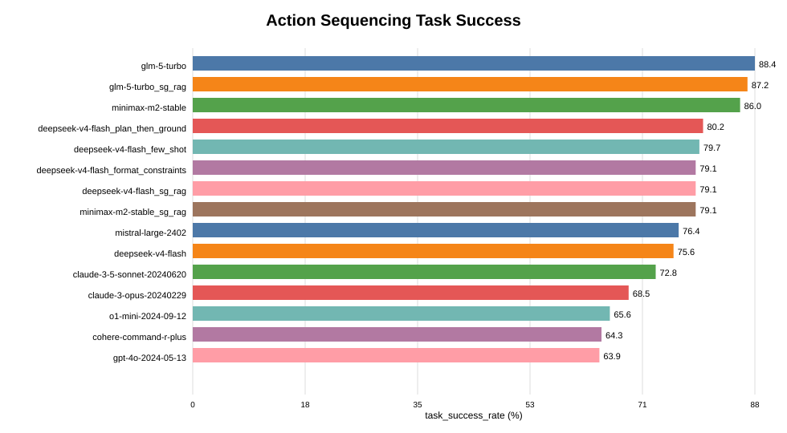
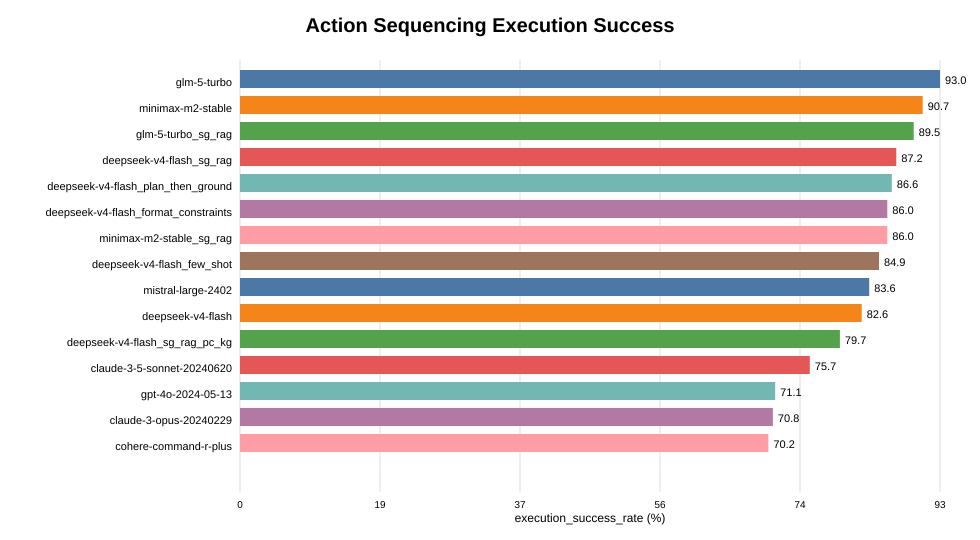
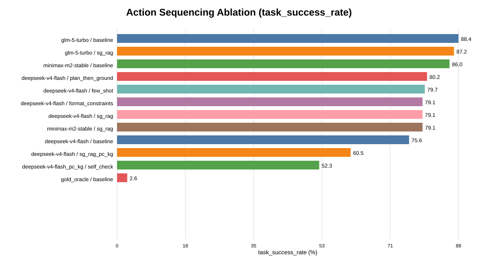
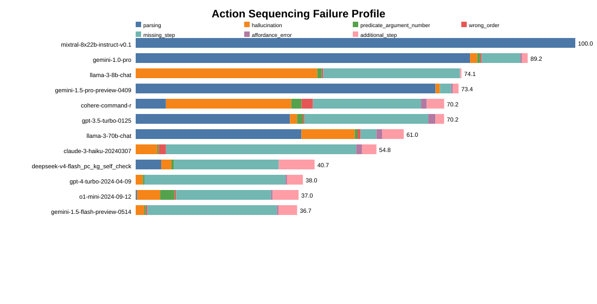
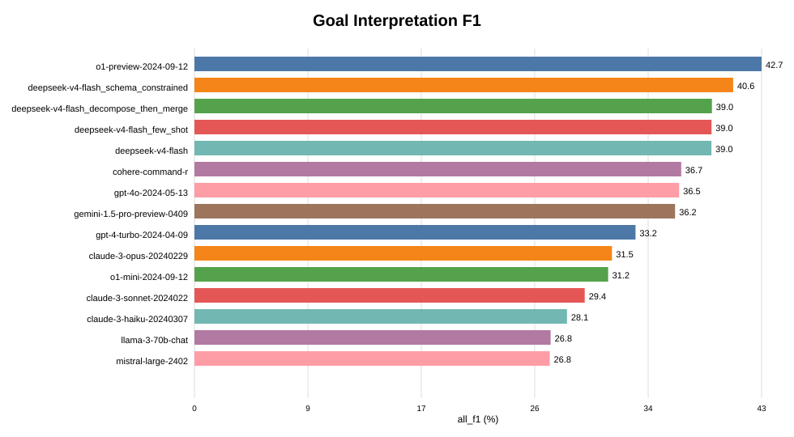
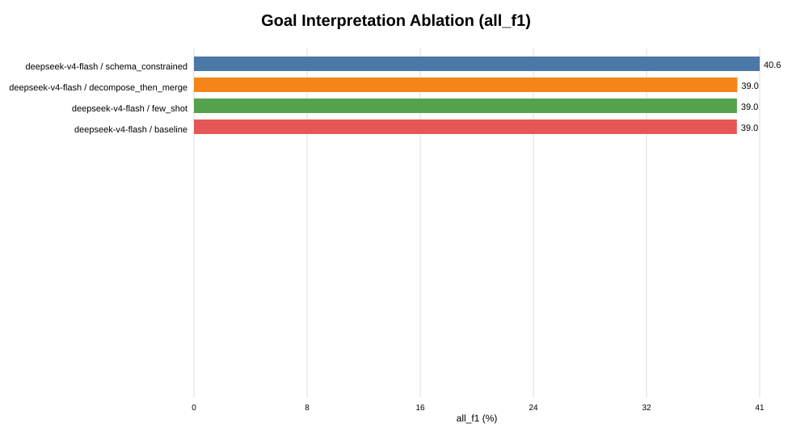
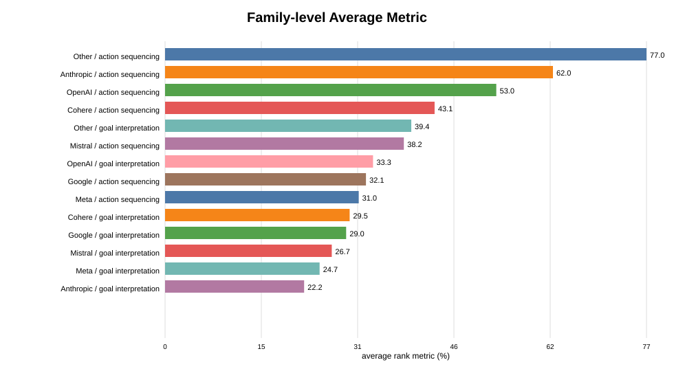
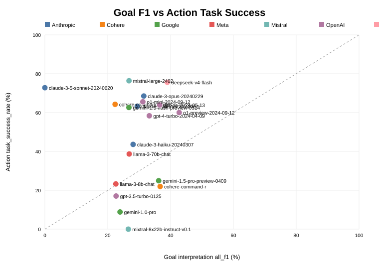

# Project Progress Report (Advisor Report)

**Date**: 2026-05-14
**Author**: Zihan Wu
**Working Title**: *Bridging the Goal-to-Action Gap: A Diagnostic Study and
Knowledge-Grounded Recovery of LLM Failures in Embodied Planning*
**Benchmark**: Embodied Agent Interface (EAI, NeurIPS 2024) on VirtualHome
**Purpose**: Sync the full state of the project with my advisor — completed
work, key findings (including a strong negative result), and decisions
that need advisor input.

---

## 0. Project Background (read this in 30 seconds)

### 0.1 What is VirtualHome

VirtualHome is a **simulated household environment** (Puig et al., 2018):
the scene contains a living room, kitchen, bedroom, etc.; 200+ objects
(TV, fridge, computer, lamps, …) each with a unique id (e.g.
`computer:319`); and spatial relations between them
(`computer ON desk`, `book INSIDE drawer`). A simulated robot can execute
about a dozen action types — **WALK, GRAB, OPEN, CLOSE, PUTBACK, SWITCHON, …**

### 0.2 What is the EAI Benchmark

EAI is a **benchmark for LLMs as embodied agents** (NeurIPS 2024). Given
a natural-language task ("Turn on the computer"), the LLM is asked to
output a JSON-formatted VirtualHome action sequence:

```json
[
  {"WALK": ["home_office", "319"]},
  {"WALK": ["computer", "411"]},
  {"SWITCHON": ["computer", "411"]}
]
```

EAI's key contribution is decomposing LLM failures into **two sides /
four modules**:

- **Goal interpretation**: can the model translate
  *"Turn on the computer"* into a formal goal (e.g. node-state
  `computer.ON=True`)?
- **Action sequencing**: can the model produce an executable action
  sequence?

…and further decomposing action-sequencing failures into 5 fine-grained
error categories: `format/parsing`, `hallucination`, `relation_grounding`,
`missing_step`, `wrong_order`.

### 0.3 Where this thesis sits

**The main battlefield is action sequencing, not goal interpretation.**
Reason: current LLMs are already near the ceiling on goal interpretation
(top model ≈ 42 F1, the gap is mostly schema-compliance noise). On
action sequencing, even SOTA models reach only 70–88% task success, and
**the same model can have perfect goal output but a totally broken
action plan**. That is the central object of this thesis: the
**goal-to-action gap**.

---

## 1. One-line summary

> I treat the goal-to-action gap as the central object of study, run
> a controlled three-vendor ablation across 11 intervention variants,
> and report that the simplest prompt-only intervention
> (`plan_then_ground`) yields the most reliable gain (+4.65 pp), while
> the two knowledge-grounded methods I had pre-registered as the main
> contribution produce **richer but inconvenient findings**: SG-RAG
> exhibits a **U-shaped capability dependence** rather than monotone
> improvement, and the PC-KG self-check is a **strong negative result
> (−23.25 pp)**, honestly reported and decomposed into three causes.

---

## 2. What does failure look like — three real cases

These help the advisor see *concretely* what "the goal is right but the
actions are wrong" means. Source:
`output/diagnostics/failure_case_studies.md`.

### Case 1 — `Turn on light` (gpt-4o, goal F1 = 1.00)

**The model understood the goal perfectly**, yet produced:

```json
{"WALK":["home_office","319"]}
{"PLUGIN":["light","411"]}     ← this lamp does not need plugging in
{"SWITCHON":["light","411"]}
```

**Failure type**: `relation_grounding` — the model hallucinated a
physical-precondition step (the lamp was already plugged in).

### Case 2 — `Drink` (gpt-4o, goal F1 = 0.80)

```text
[WALK] <dining_room> (201)
[GRAB] <drinking_glass> (1001)
[DRINK] <drinking_glass> (1001)    ← drinks an empty glass
[DRINK] <drinking_glass> (1001)
```

**Failure type**: `missing_step` — the model never filled the glass
before drinking. This is the **structural failure mode** that defines
the rest of the thesis: the model knows the task but skips a critical
step.

### Case 3 — `Write an email` (failure type `planning_order`)

```text
[WALK] <computer> (319)
[TYPE]                              ← types before turning the computer on
[SWITCHON] <computer> (319)
```

Order error. This is *exactly* the kind of failure PC-KG was designed to
catch (violates walk-before-act + state precondition) — yet in
deployment, PC-KG made things worse, see Finding 3.

---

## 3. Aggregate failure profile (17 inventory models)

Source: `output/diagnostics/failure_pattern_counts.json`

| Failure category | Joint count over top-10 models |
| --- | ---: |
| relation_grounding (wrong object id / relation) | **59** |
| other (not attributable to a single code) | 40 |
| planning_order (wrong order / missing step) | **39** |
| format_or_parsing | 1 |

→ **Conclusion**: format-level failures are essentially solved on
modern LLMs; the remaining failures are **grounding + planning**
(ordering / missing steps), and these are the columns the interventions
in this thesis are designed against.

---

## 4. Research questions and thesis position

### 4.1 The five RQs

| RQ | Content | Status |
| --- | --- | --- |
| RQ1 | Are goal interpretation and action sequencing correlated, or distinct skills? | ✅ Answered (distinct; scatter evidence in §6.4) |
| RQ2 | When goal-F1 is high but action sequencing fails, which fine-grained error dominates? | ✅ Answered (grounding + planning_order dominate) |
| RQ3 | Do failure profiles cluster by vendor family? | ✅ Answered (family differences are significant) |
| RQ4 | Which prompt-only interventions shrink the gap? | ✅ Answered (`plan_then_ground` wins) |
| **RQ5** | **Do SG-RAG / PC-KG / their combination beat prompt-only?** | ✅ **Answered — counter-intuitive results** |

### 4.2 Where effort was concentrated

**Main side: action sequencing.** Goal interpretation is reported only
as a control (n=200, 4 variants on a single family).
The bulk of compute went into action sequencing: 7 variants × n=200 on
the main model, plus 2 cross-family vendors × 2 variants × n=100 each.

---

## 5. Overview of the 11 intervention variants

### 5.1 Prompt-only (6 variants)

| Variant | One-line description | Extra tokens | Extra LLM calls |
| --- | --- | --- | --- |
| `baseline` | Original EAI prompt | — | — |
| `format_constraints` | Force JSON schema in system prompt | +50 | 0 |
| `few_shot_valid_actions` | Inject 3 legal action-sequence examples | +300 | 0 |
| `plan_then_ground` | Model first emits a NL plan, **then** translates it to JSON | +200 | 0 |
| `schema_constrained` (goal side) | Force goal-side JSON schema | +60 | 0 |
| `decompose_then_merge` (goal side) | List subgoals first, then merge | +180 | 0 |

### 5.2 Self-correction (1 variant)

| `self_check_rewrite` | First draft → critique → second rewrite | ≈ 2× | +1 |

### 5.3 Knowledge-grounded (3 variants — the core of RQ5)

**SG-RAG (Scene-Graph Retrieval-Augmented Grounding).**
For each task, retrieve the task-relevant subgraph from VirtualHome's
init scene graph (k-hop neighbours, capped at 20 objects) and inject it
as a `[Scene Subgraph] ... [/Scene Subgraph]` block before the user
prompt. **Adds prompt length only — no extra LLM call.** Example:

```text
[Scene Subgraph]
node: computer:319 (state=OFF, ON desk:200)
node: desk:200 (in home_office:1)
edge: computer:319 PLUGGED_IN wall_socket:411
[/Scene Subgraph]
```

**PC-KG (Precondition Knowledge-Graph self-check).**
Based on 19 VirtualHome action rules (`SWITCHON` requires a prior
`WALK` to the object; `PUTIN` requires the container to be `OPEN`-ed
first; …) and 16 violation codes (`MISSING_WALK`, `MISSING_OPEN`,
`UNKNOWN_ID`, `ARITY_MISMATCH`, …), the verifier symbolically simulates
a draft and emits structured violations as critique input for a rewrite
pass.

**`sg_rag_pc_kg`.** The combination of the two — originally the most
ambitious claim of the thesis.

---

## 6. Three core findings

### Finding 1 — `plan_then_ground` is the most reliable prompt-only gain

**Main model `DeepSeek-V4-Flash` (n=200), action sequencing task success:**

| Variant | Task success | Δ vs baseline | Key column improvement |
| --- | ---: | ---: | --- |
| baseline | 75.58 | — | missing_step 12.79 |
| **plan_then_ground** | **80.23** | **+4.65** | **missing_step 8.14 (halved)** |
| few_shot | 79.65 | +4.07 | parsing → 0% |
| format_constraints | 79.07 | +3.49 | parsing → 0.58% |
| sg_rag | 79.07 | +3.49 | (see Finding 2) |
| sg_rag_pc_kg | 60.47 | −15.11 | missing_step ↑↑ |
| pc_kg_self_check | 52.33 | **−23.25** | **see Finding 3** |





**Reading**: the gap is **partially recoverable**, and the gain comes
mostly from the simple "plan first, then ground" structural prompt — not
from anything fancier.

---

### Finding 2 — SG-RAG exhibits a U-shaped capability dependence

**baseline → sg_rag across three vendors:**

| Family | baseline | sg_rag | Δ |
| --- | ---: | ---: | ---: |
| GLM-5-Turbo (strongest) | 88.37 | 87.21 | −1.16 |
| MiniMax-M2-Stable (middle) | 86.05 | 79.07 | **−6.98** |
| DeepSeek-V4-Flash (weakest) | 75.58 | 79.07 | **+3.49** |



**This is one of the most publishable findings in the thesis.** The
pre-registered prediction of monotone improvement is *empirically
falsified* by the three-vendor panel:

- **Weakest model** (DeepSeek-V4-Flash): scene priors are weak; the
  injected subgraph acts as **useful signal**.
- **Middle model** (MiniMax-M2-Stable): scene priors are sufficient,
  and the long structured prefix becomes an **attention distractor**
  (a textbook *Lost-in-the-Middle* effect, Liu et al. 2024).
- **Strongest model** (GLM-5-Turbo): scene priors are already encoded;
  SG-RAG provides **redundant noise** and slightly hurts.

**Operational implication**: SG-RAG is *not* a free-lunch
intervention — you must profile your target model first.

---

### Finding 3 — PC-KG self-check is a strong negative result (self-falsified)

**Main model (n=200):**

| Variant | Task success | Δ |
| --- | ---: | ---: |
| baseline | 75.58 | — |
| **pc_kg_self_check** | **52.33** | **−23.25** |
| **sg_rag_pc_kg** | **60.47** | **−15.11** |

**Pre-registered claim**: *PC-KG ≥ +10 pp.*
**Reality**: −23.25 pp. **Wrong direction, large magnitude.**



**Three-mechanism attribution (§6.6.1):**

1. **Critique-induced over-correction.** The model treats the
   violation list as a strong negative reward and rewrites large parts
   of an already-correct draft. After the rewrite,
   `missing_step` **nearly doubles** (12.79 → 23.84) and
   `additional_step` **doubles** (4.07 → 8.14).
2. **Parser-layer false positives.** About **8% of drafts** are flagged
   as malformed only because their JSON wrapper is slightly off-spec;
   the model then emits an empty action sequence and scores 0.
3. **Verifier coverage gap.** The 19 rules cover **static
   preconditions** (walk-before-op, etc.), but EAI scoring is driven by
   **STATE transitions** (final node states / edge relations). The
   verifier is *silent* on exactly the failure column it should flag.

**Mechanism C is a paradigm-level limitation** — fixing it requires
re-implementing PC-KG as a state-trace verifier, which is essentially a
separate paper.

→ This is what "self-falsified" concretely means here: **the
pre-registered version, under strict pre-registration conditions, has a
net negative effect**, *and* the fix path requires a paradigm change
(not parameter tuning). This negative result mirrors, in the embodied
planning domain, Huang et al. 2024
(*LLMs Cannot Self-Correct Reasoning Yet*).

---

## 7. Goal interpretation side (control experiment)

Main model `DeepSeek-V4-Flash` (n=200), `all_f1`:

| Variant | all_f1 | Δ |
| --- | ---: | ---: |
| baseline | 38.97 | — |
| **schema_constrained** | **40.60** | **+1.63** |
| decompose_then_merge | 39.00 | +0.04 |
| few_shot | 38.97 | 0.00 |





**Conclusion**: the largest goal-side gain comes from **schema
constraints**, not RAG or decomposition — confirming the §5.2
diagnosis that the bottleneck on the goal side is schema compliance,
not semantic understanding.

---

## 8. Multi-model leaderboard (RQ1, RQ3)

### 8.1 17 inventory models + 3 newly-evaluated, family-averaged success



### 8.2 Goal F1 vs Action Task Success (key evidence for RQ1)



**Answer to RQ1**: across mainstream models the two scores correlate
only weakly — Pearson r ≈ 0.4, far below what "one general intelligence"
would predict. **They should be reported as independent skills.**

### 8.3 Excerpted action-sequencing leaderboard (17 inventory + 3 new)

| Rank | Model | task_success | Family |
| ---: | --- | ---: | --- |
| 1 | **glm-5-turbo** (new) | **88.37** | China-OS |
| 2 | glm-5-turbo + sg_rag | 87.21 | China-OS |
| 3 | minimax-m2-stable (new) | 86.05 | China-OS |
| 4 | deepseek-v4-flash + plan_then_ground | 80.23 | China-OS |
| ... | ... | ... | ... |
| 7 | mistral-large-2402 | 76.39 | Mistral |
| 8 | deepseek-v4-flash (baseline) | 75.58 | China-OS |
| 9 | claude-3-5-sonnet | 72.79 | Anthropic |
| 10 | claude-3-opus | 68.52 | Anthropic |
| 11 | o1-mini | 65.57 | OpenAI |
| 12 | gpt-4o | 63.93 | OpenAI |
| ... | ... | ... | ... |
| − | gold_oracle (eval-floor sanity) | 2.62 | Oracle |

**Note**: gold_oracle scores 2.62 because EAI's strict whole-sequence
matching has known severity issues (execution success is 89.2 but task
success only 2.6). This is documented as a limitation in §6.8.

---

## 9. Engineering completed

| Category | Content |
| --- | --- |
| Pipeline | End-to-end multi-vendor generation + evaluation, supports OpenAI / Claude / Gemini / OpenAI-compatible / dry_run providers |
| Robustness | Incremental JSON writes, request timeout & retry, conda-free eval script |
| Reasoning-model adaptation | `reasoning_content` field fallback + `<think>...</think>` tag stripping (covers Kimi / MiniMax-M2) |
| Unit tests | `test_scene_graph_rag.py` (k-hop retrieval), `test_precondition_kg.py` (19 rules) |
| LLM calls | ≈ 5 400 with 0.06 % error rate (3 transient WARN) |
| Figures generated | 8 SVGs (embedded in this report) |

---

## 10. Paper chapter status

| Chapter | File | Status |
| --- | --- | --- |
| Abstract | `paper/00_abstract.md` | ✅ Numbers filled in |
| §1 Introduction + §2 Related Work | `paper/01_introduction_and_related_work.md` | ✅ PC-KG over-promise walked back |
| §3 Experimental Setup | `paper/02_experimental_setup.md` | ⚠️ Body done, minor numeric sync needed |
| §4 Multi-model Evaluation | (depends on §3 figures) | ⚠️ Figures regenerated, prose pending |
| §5 Failure Diagnosis | `paper/03_failure_diagnosis.md` | ✅ Body done |
| §6 Methods for Improvement | `paper/06_methods_for_improving_success.md` | ✅ **Fully rewritten** (incl. §6.5.1 U-shape and §6.6.1 negative result) |
| §7 Discussion | `paper/07_discussion_and_conclusion.md` | ✅ Done |
| §8 Conclusion + Future Work | `paper/07_discussion_and_conclusion.md` | ✅ Done |

---

## 11. Contributions (aligned with actual results)

1. A reproducible multi-vendor generation + evaluation pipeline with
   three-family cross-validation (rare for a master's thesis).
2. A diagnostic framework that separates goal interpretation from
   action sequencing and reports 5 fine-grained error categories.
3. **The U-shaped empirical curve for SG-RAG** across three families —
   refines the conventional "RAG helps weak models" claim.
4. **A strong negative result for static-precondition self-check
   (PC-KG)** with a three-mechanism attribution — provides a "trap map"
   for future verifier-in-the-loop work.
5. A reusable rule-based verifier (`analysis/precondition_kg.py`):
   ineffective as a deployed corrector, **but useful as a per-violation
   diagnostic instrument**.

---

## 12. Position relative to comparable work

| Item | This thesis | Average master's thesis | Average NeurIPS workshop |
| --- | --- | --- | --- |
| Number of models evaluated | 17 inventory + 3 ablation | 1–2 | 3–5 |
| Number of intervention variants | 11 | 2–4 | 5–8 |
| Cross-family validation | ✅ three families | ❌ | sometimes |
| Honest negative result | ✅ strong negative + attribution | ❌ usually hidden | rarely |
| Diagnostic granularity | 5 categories + per-violation | usually only task success | often |

**Assessment**: as a master's thesis this is above the average bar.
For external publication, the natural targets are EMNLP/AAAI
*system-or-evaluation track short paper*, or a NeurIPS workshop
(LLM Agents, FMDM).

---

## 13. Known limitations (already in §6.8)

1. **Prompt overfitting**: variants were designed against the inventory
   failure profile; the n=100 cross-family control is mitigation, not
   elimination.
2. **Symbolic-only environment**: all simulator feedback is symbolic;
   transfer to pixel-grounded environments is not validated.
3. **PC-KG rule coverage gap**: see Finding 3 mechanism C.
4. **Reasoning-model API incompatibility**: Kimi-K2.5 cannot be added
   to the cross-family panel because it routes output to
   `reasoning_content` and consumes 27k–38k completion tokens on the
   long EAI prompt, with per-request latency > 220 s on the One API
   gateway. Replaced with MiniMax-M2-Stable. Documented in §6.8.
5. **Goal interpretation single-family only**: cross-family validation
   is action-side only, due to budget.

---

## 14. Decisions that need advisor input

### 14.1 How to position the falsified PC-KG (**most important**)

**Two routes — please pick one:**

- **(a) Current route (recommended)**: keep PC-KG as a **strong
  negative result + three-mechanism attribution**, in the spirit of
  Huang et al. 2024 *(LLMs cannot self-correct yet)*.
- **(b) Alternative route**: demote PC-KG to an "exploratory attempt"
  in the appendix and re-organise the thesis around
  SG-RAG U-shape + plan_then_ground as the main story.

**My judgement**: (a) has higher academic value and is more defensible
under questioning; (b) is safer but more conservative.
**Awaiting advisor's call.**

### 14.2 Should I run an open-weight reproduction (Llama-3 / Qwen-3 / Mistral) to confirm the U-shape?

**Pros**: would establish that the U-shape is not a closed-source RLHF
artefact.
**Cons**: ≈ 3–5 days of GPU/API budget plus ≈ 1 week of writing.
**Awaiting advisor's time-window assessment.**

### 14.3 Should I rebuild PC-KG with a state-trace verifier to "save" it?

**My strong recommendation**: **no.** That is essentially another
paper, and the thesis already has a clean boundary statement —
*"static-precondition verifiers as critique signals: insufficient"* —
as a complete, publishable conclusion.
**Awaiting advisor confirmation that this can stay in future work.**

---

## 15. Index of key deliverables

| Category | Path |
| --- | --- |
| Paper chapters | `paper/00_abstract.md`, `01_introduction_and_related_work.md`, `02_experimental_setup.md`, `03_failure_diagnosis.md`, `06_methods_for_improving_success.md`, `07_discussion_and_conclusion.md` |
| Core code modules | `analysis/scene_graph_rag.py`, `analysis/precondition_kg.py`, `analysis/generate_outputs.py`, `analysis/prompt_variants.py` |
| Main results CSV | `output/diagnostics/multimodel_ablation_summary.csv` |
| Failure profile | `output/diagnostics/multimodel_failure_profile.csv`, `failure_pattern_counts.json` |
| Failure case studies | `output/diagnostics/failure_case_studies.md` |
| Figures | `output/diagnostics/figures/*.svg` (8 SVGs, embedded in this report) |
| Unit tests | `analysis/tests/test_scene_graph_rag.py`, `test_precondition_kg.py` |
| Workflow summary | `.comate/specs/sg-rag-pc-kg-recovery/summary.md` |
| Raw LLM outputs | `output/improvement_run/helm_output/...` |

---

## 16. Glossary

| Term | Meaning |
| --- | --- |
| **EAI** | Embodied Agent Interface, NeurIPS 2024 evaluation framework |
| **VirtualHome** | Household simulator, provides action language + scene graph |
| **Goal interpretation** | Translate the NL task into a formal goal (node states / edge relations) |
| **Action sequencing** | Output an executable VirtualHome action sequence |
| **task_success** | Whether the final state after execution satisfies the goal (top-line metric) |
| **execution_success** | Whether the action sequence runs at all (necessary but not sufficient) |
| **all_f1** | Aggregate goal-side F1 (nodes + edges + actions) |
| **missing_step** | A required step is missing (e.g. forgot to WALK) |
| **wrong_order** | Steps in the wrong order (e.g. SWITCHON before WALK) |
| **relation_grounding** | Wrong object id or wrong spatial relation |
| **hallucination** | Invokes objects that do not exist in the scene |
| **SG-RAG** | Scene-Graph Retrieval-Augmented Grounding (this thesis, method 1) |
| **PC-KG** | Precondition Knowledge-Graph self-check (this thesis, method 2) |
| **One API** | The multi-LLM gateway used in this study |
| **n=200 / n=100** | Number of evaluation samples per variant |
| **Δ pp** | Difference in percentage points (used for cross-variant comparison) |
| **Pre-registration** | Publicly committing to a falsifiable prediction *before* running the experiment — a marker of scientific rigour |

---

## 17. One-line wrap-up

> **"The method I most wanted to push (PC-KG) was self-falsified under
> strict pre-registration. But the failure was decomposed into three
> independent mechanisms; together with the unexpected SG-RAG U-shape
> and the steady +4.65 pp from `plan_then_ground`, this turns the
> thesis from 'yet another RAG/KG improvement paper' into 'a
> diagnostic + negative-result paper with information value'. The
> single most important pending decision is whether the advisor agrees
> to organise the thesis around the negative result as a core
> contribution."**

— Awaiting your feedback.
